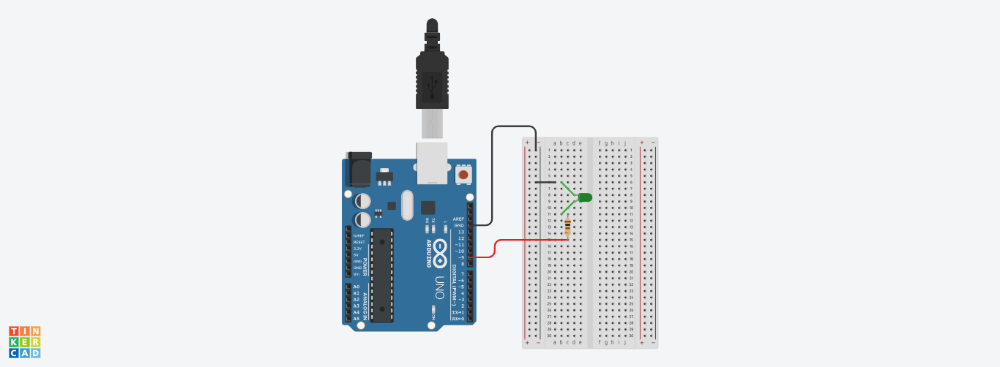

## Project: LED Pulse & Fading Control (PWM)
=====================================================

An Arduino project demonstrating smooth LED brightness control using Pulse Width Modulation (PWM) and continuous variable looping.

Pulse Width Modulation (PWM): Simulates an analog voltage signal by rapidly pulsing
 a digital pin high and low at varying duty cycles (0 to 255).

analogWrite() Function: Outputs a PWM signal to compatible digital pins (Pins 3, 5, 6, 9, 10, and 11 on the Arduino Uno).
===========================================================
## Components Used
- 📷 Circuit Setup🛠️ Components Used
-1x Arduino Uno R3
-1x LED (connected to PWM pin)
-1x 220 Ohms  Resistor
-1x Breadboard
Jumper Wires📋 Circuit Wiring GuideComponent
Digital Pin 9Must be a PWM pin (marked with ~)LED 
Cathode (-)GND RailConnects directly to Arduino GND

## Circuit Photo
