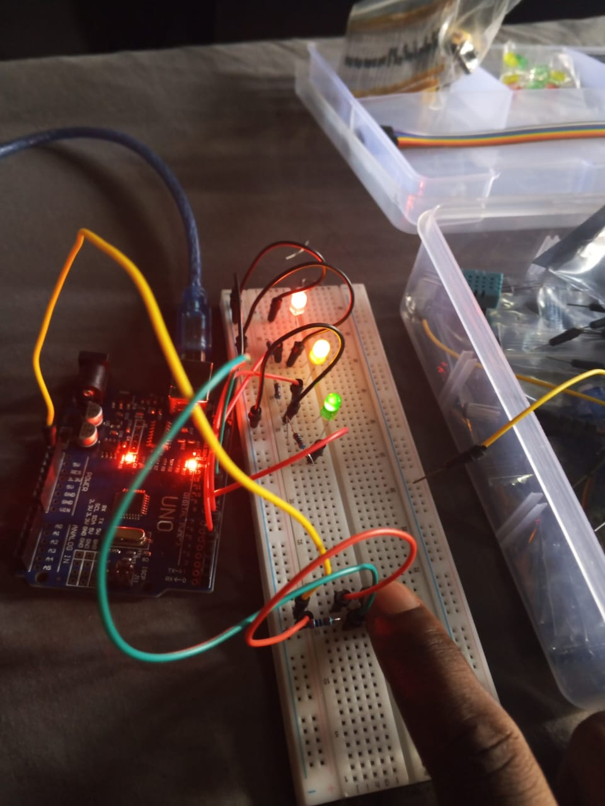

# Multi-LED Morse Code SOS Visualizer

 ===============================================================================
  Project Name: Multi-LED Morse Code SOS Visualizer
  Description:  This program blinks three LEDs (Red, Yellow, and Green) 
  together at the same time to flash the international 
  distress signal: S.O.S. Morse Code Timing Standards Used:
    - Dot (.)    = 200ms
    - Dash (-)   = 600ms (Exactly 3x the duration of a dot)
    - Part Gap   = 200ms (Silence between blinks within the same letter)
    - Letter Gap = 400ms (Silence between S, O, and S)
 ================================================================================

## Circuit Photo

## Components Used
- 1x Arduino Uno R3
- 1x Red LEDs 
- 1x YELLOW LEDs 
- 1x GREEN LEDs 
- 
- 3x Resistors (220 ohms)
- 1x Breadboard