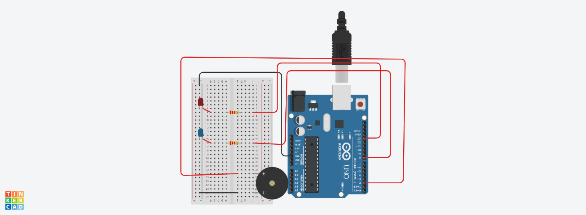

## Project: LED Pulse & Fading Control (PWM)
=====================================================

An Arduino project demonstrating precise timing logic using delay() and tone() with a passive buzzer and dual LED state toggling. Because Arduino executes code sequentially and delay() freezes the execution state, splitting the delay allows short audio feedback without affecting overall display timing:
===========================================================
## Components Used
- 📷 Circuit Setup🛠️ Components Used
-1x Arduino Uno R3
-1x Red LED 
-1x Blue LED 
-2x 220 Ohms  Resistor
-1x Breadboard
- 1x Buzzer
Jumper Wire

## Circuit Photo
