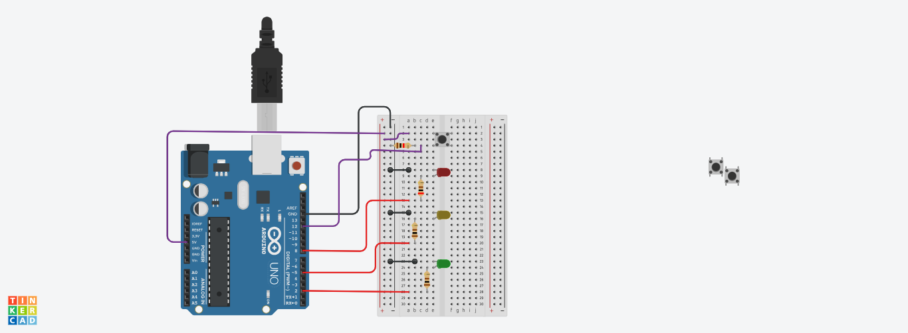

# LED ON & OFF STATE WITH A BUTTON PRESSED

#
  ==================================================================
   ==================================================================
  PROJECT: LED ON & OFF STATE WITH A BUTTON PRESSED
  ==================================================================
  
  WHAT THIS CODE DOES:
  in the previous project, when a button is pressed, it turns an LEd on/off. Then when it is released, it turns it back off/on. however, in this sketch, pressing  and releasing the button turns the led on/off. then pressing and releasing it again reverses the state. this is a subtle distinction from the other one. this is practicable in almost all our switches such as bulb switch. 
  ==================================================================
*/

## Circuit Photo

