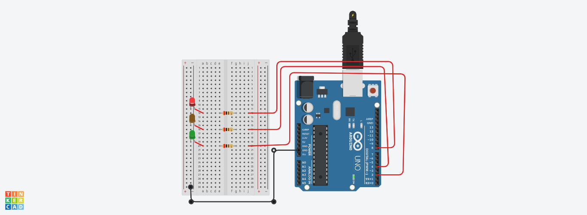

# Traffic Light Control LEDs

An Arduino project featuring traffic light sequencing.

## Circuit Photo

## Components Used
- 1x Arduino Uno R3
- 3x LEDs (Pins 8, 4 & 2)
- 3x Resistors (220 ohms)
- 1x Breadboard