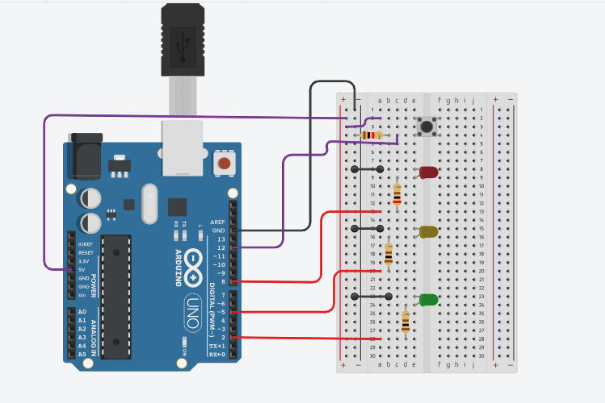

# Traffic Light Control LEDs

An Arduino project featuring traffic light sequencing.

## Circuit Photo

## Components Used
- 1x Arduino Uno R3
- 3x LEDs (Pins 2,5  & 8)
- 3x Resistors (220 ohms)
- 1x Resistors (1kohms)
- 1x Breadboard
-- 1 button