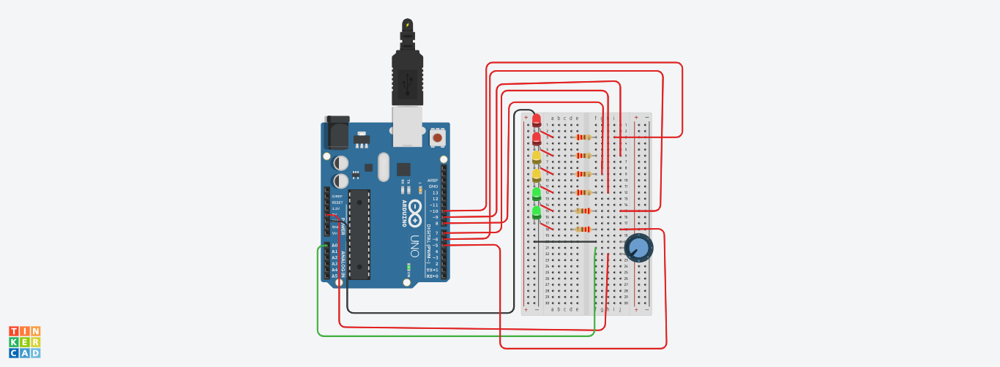

# LED_Bargraph with Potentiometer

#
  ==================================================================
  HOW IT WORKS: LED Bar Graph Display
  ==================================================================
  A bar graph is a row of LEDs arranged in a straight line, similar 
  to the volume audio meters you see on sound equipment. 
  
  In this project, we read an analog signal from a potentiometer to 
  control how many LEDs light up. 
  
  IMPORTANT LOGIC NOTE: 
  We are NOT fading the brightness of individual LEDs here. Instead, 
  we are sequencing them (turning them on or off one by one) based on 
  the physical position of the knob.
  
  - Turning the knob one way lights up the LEDs one at a time in sequence 
    until the whole bar is glowing.
  - Turning the knob back the other way turns them off in the reverse 
    sequence.
.

## Circuit Photo

## Components Used
- 1x Arduino Uno R3
- 2x Red LEDs 
- 2x yellow LEDs 
- 2x green LEDs 
- 6x Resistors (220 ohms)
- 1x Breadboard
--1X Potentiometer