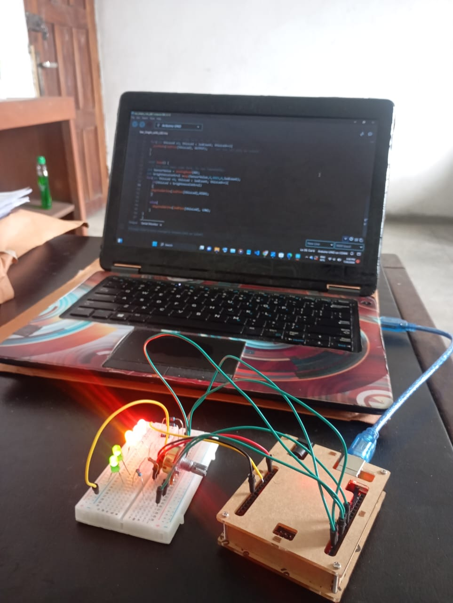

# Variable Strobe Light & Synchronized Audio Alarm

#
  ==================================================================
   ==================================================================
  PROJECT: Variable Strobe Light & Synchronized Audio Alarm
  ==================================================================
  
  WHAT THIS CODE DOES:
  This sketch creates a dual-LED strobe flashing sequence (Pin 12 
  and Pin 11) accompanied by an active buzzer beep. An analog 
  potentiometer is used to dynamically adjust the flashing speed 
  and audio tempo in real time.
  
  HOW IT WORKS:
  1. The Arduino reads the position of the potentiometer (0 to 1023) 
     on Analog Pin A1.
  2. The map() function translates that raw value into a timing delay 
     ranging from 10 ms (rapid strobe) to 500 ms (slow pulse).
  3. The code alternates triggering Pin 12 and Pin 11 while toggling 
     Pin 10 HIGH and LOW so the buzzer clicks/beeps in exact sync 
     with the visual flash.
     
  PIN CONFIGURATION:
  - Potentiometer Signal -> Analog Pin A1
  - Strobe LED 1         -> Digital Pin 12
  - Strobe LED 2         -> Digital Pin 11
  - Active Buzzer (+)    -> Digital Pin 8
  ==================================================================
*/

## Circuit Photo

## Components Used
- 1x Arduino Uno R3
- 2x Red LEDs 
- 2x blue LEDs 
- 1 passive buzzer
- 2x Resistors (220 ohms)
- 1x Breadboard
--1X Potentiometer